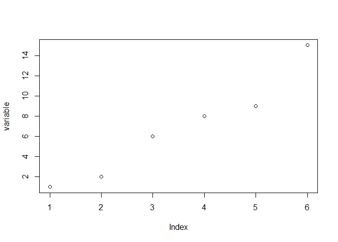

## simplePipes Examples

### Input Data


```r
variable=c(1,2,6,8,9,15)
variable1=c(1,2,6,8,9,15)
variable2=c(4,3,5,6,4,10)
frame=data.frame(variable1,variable2)
```

### Basic Pipes

#### Forward Basic Pipe


```r
mean(variable)
```

```
## [1] 6.833333
```

```r
variable %>% mean
```

```
## [1] 6.833333
```

#### Backward Basic Pipe


```r
mean(variable)
```

```
## [1] 6.833333
```

```r
mean %<% variable
```

```
## [1] 6.833333
```

### Dot Pipes

#### Forward Dot Pipe


```r
mean(variable,trim=.2)
```

```
## [1] 6.25
```

```r
variable %.>% mean(.,trim=.2)
```

```
## [1] 6.25
```

```r
variable %.>% mean(.,trim=.2) %.>% round(.,digits=1)
```

```
## [1] 6.2
```

#### Backward Dot Pipe


```r
mean(variable,trim=.2)
```

```
## [1] 6.25
```

```r
mean(.,trim=.2) %<.% variable
```

```
## [1] 6.25
```

```r
round(.,digits=1) %<.% mean(.,trim=.2) %<.% variable
```

```
## [1] 6.2
```

### Tee Pipe

#### Forward Tee Pipe


```r
plot(variable); mean(variable)
```

<!-- -->

```
## [1] 6.833333
```

```r
variable %T>% plot %>% mean
```

<!-- -->

```
## [1] 6.833333
```

#### Backward Tee Pipe


```r
plot(variable); mean(variable)
```

<!-- -->

```
## [1] 6.833333
```

```r
plot %<T% variable %>% mean
```

<!-- -->

```
## [1] 6.833333
```

### Wye Pipes

#### Forward Wye Pipe


```r
mean(variable); sd(variable)
```

```
## [1] 6.833333
```

```
## [1] 5.115336
```

```r
variable %Y>% c(mean,sd)
```

```
## [1] 6.833333 5.115336
```

#### Backward Wye Pipe


```r
mean(variable); sd(variable)
```

```
## [1] 6.833333
```

```
## [1] 5.115336
```

```r
c(mean,sd) %<Y% variable
```

```
## [1] 6.833333 5.115336
```

### Exposition Pipes

#### Forward Exposition Pipe


```r
frame %$>% mean(variable2)
```

```
## [1] 5.333333
```

#### Backward Exposition Pipe


```r
mean(variable2) %<$% frame
```

```
## [1] 5.333333
```

### Compound Assignment Pipe


```r
newvariable <- variable
newvariable %<>% mean
newvariable
```

```
## [1] 6.833333
```
