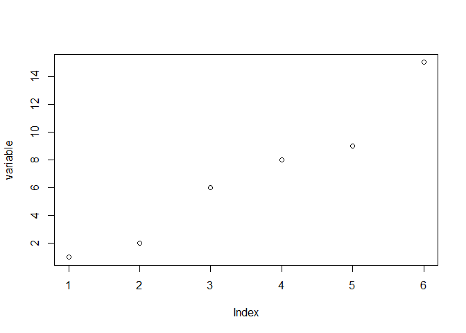

## Tee Pipes

Tee pipes also involve chaining commands but are used when an
intermediate command produces output (such as a plot). The intermediate
command also acts as a flow-through to a third command in the chain.

- [Input Data](#input-data)
- [Standard R Syntax](#standard-r-syntax)
- [Native Pipe](#native-pipe)
- [Forward Tee Pipe](#forward-tee-pipe)
- [Backward Tee Pipe](#backward-tee-pipe)

------------------------------------------------------------------------

### Input Data

First, name a `variable` and assign an array of values back to it.

``` r
variable <- c(1, 2, 6, 8, 9, 15)
```

Though it’s not commonly demonstrated, R does permit forward assignment
of vales to a `variable`.

``` r
c(1, 2, 6, 8, 9, 15) -> variable
```

### Standard R Syntax

In standard R syntax, `plot` the `variable` and then get the `mean` of
the `variable`.

``` r
plot(variable)
```

<!-- -->

``` r
mean(variable)
```

    ## [1] 6.833333

### Native Pipe

After version 4.1, R includes a native forward pipe and shorthand syntax
for anonymous functions. With R 4.3, curly braces extend this
functionality.

Here, the anonymous function is used to create a placeholder (`x`) and
then to `plot` the `variable` and then get the `mean` of the `variable`.
(For functions that print output rather than plot, additional
manipulation is needed. See the implementation of through pipes.)

``` r
variable |> (\(x) { plot(x); x } )() |> mean()
```

<!-- -->

    ## [1] 6.833333

### Forward Tee Pipe

Using the forward tee pipe (and chaining in a basic pipe), identify the
`variable` and then `plot` it and get its `mean`.

``` r
variable %T>% plot %>% mean
```

<!-- -->

    ## [1] 6.833333

### Backward Tee Pipe

Using the backward tee pipe (and chaining in a basic pipe), `plot` the
`variable` and then get its `mean`.

``` r
plot %<T% variable %>% mean
```

<!-- -->

    ## [1] 6.833333
